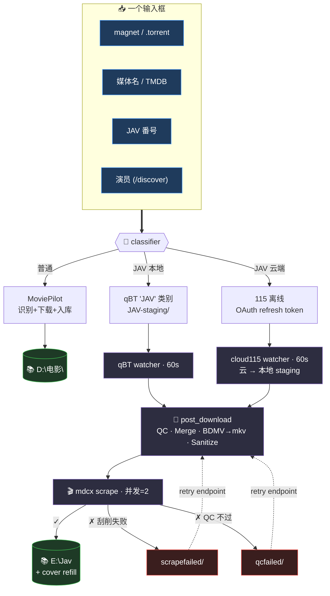

# mp-relay

把"贴磁力链 / 输入媒体名 / 输入番号 / 找演员"统一收口到一个 Web UI，
自动分发到合适的下载/刮削管道。跑在 Windows 媒体服务器（与 MoviePilot /
qBittorrent / mdcx 同机），单页 Web UI 监听 `:5000`。



## Web UI 一览

| 路径 | 用途 |
|---|---|
| **`/`** | 单输入框主页 + 最近任务列表（10s 自动刷新） |
| **`/discover`** | 演员发现页 —— 搜演员名 → 列出该演员所有番号（可隐藏已拥有）→ 多选批量"加入 qBT"或"加入 115" |
| **`/setup`** | 配置向导 —— 4 张卡（mdcx / MoviePilot / qBittorrent / Jellyfin），每张 Test connection + Save，热加载不重启 |
| **`/health`** | JSON 健康检查 —— mdcx / Telegram / Bangumi / 115 各服务状态 |
| **`/metrics`** | Prometheus 指标 —— `mp-relay-grafana.json` 仪表盘可直接导入 |
| `/auth/115` | 115 OAuth 设备码授权页（首次配 115 离线时用） |

## 设计目标

- **单输入框**：贴啥都行，自动识别 magnet / .torrent URL / 番号 / 媒体名 / 演员
- **不重造轮子**：MoviePilot 已有的事不重做（TMDB 识别 / 站点搜索 / 整理入库）
- **JAV 走专门管道**：MoviePilot 识别不了番号，由 mdcx 接管
- **全自动**：watcher 监 qBT / 115 完成事件 → post-download 管线 → mdcx → 归档
- **Fail-soft**：每一步都能检测失败 + 标记 + 通过 retry endpoint 重跑

## 主要功能

按"输入 → 分发 → 后处理 → 运维"四档展开（开发时间线在 `git log` 里以 `Phase X` 标）。

### 📥 输入与搜索
- **统一识别** magnet / `.torrent` URL / 媒体名 / TMDB ID / JAV 番号 / TMDB 或豆瓣详情页 URL
- **番号搜种**：sukebei + JavBus + JavDB + MissAV 多源并行（按 hash 去重；可疑度↑ / 中字↑ / 做种↑ / 画质↑ / 体积↑ 排序）
- **演员发现** (`/discover`)：演员 / 系列 / 厂牌 / 类别 / 导演下所有番号都列出来，"隐藏已拥有"过滤本地库重复，多选一键加入 qBT 或 115
- **名字 fallback**：TMDB 0 候选时自动回退 Bangumi + AniList（动漫别名命中率高）

### 🚀 分发 — 三条管道按需选

| 输入类型 | 后端 | 落点 |
|---|---|---|
| 普通媒体 | MoviePilot `/api/v1/download/add` | 自动识别 + 下载 + 整理入 `D:\电影\` |
| JAV / 本地下载 | qBT `JAV` 类别 | `G:\Downloads\JAV-staging\` |
| JAV / 云端下载 | 115 OAuth `offline_add_url` | 云端下完后 watcher 同步回本地 staging |

### 🔧 下载后处理（所有 JAV 任务都进同一条管线）
1. **QC**：ffprobe 时长 + 文件大小，过滤假文件 / 通片广告水印 / 11 MiB 占位
2. **Merge**：CD1+CD2... → 单 `.mp4`（concat-copy）；BDMV/VIDEO_TS → 单 `.mkv`（remux 主播放列）
3. **Sanitize**：剥 `[4K]` / `@` / `()` 等让 mdcx glob 抓瞎的字符
4. **mdcx scrape**：并发限 2（早期 60 并发风暴被 JavBus 限流卡死，硬限至今）
5. **Cover refill**：mdcx 因 Cloudflare 拦封面时，按 NFO 里的 javdbid 从 JavDB CDN 兜底补 `poster / fanart / thumb / folder`

失败分两类落点（在 `/setup` 可改路径，默认 sibling collector）：
- `scrapefailed/` — mdcx 没认出来 → `/api/cloud115/retry-failed-scrapes` 重跑
- `qcfailed/` — QC 没过 → 自动 swap 下一个候选种子（最多 3 次）

### ⚙️ 运维 / 监控
- **`/setup` 配置向导**：mdcx / MoviePilot / qBT / Jellyfin 四张卡，Test connection + Save，热加载无需重启
- **mdcx 字段透出**：8 个常改字段（`success_output_folder` / `proxy` / `timeout` / ...）通过 mdcx CLI 桥接，直接在 mp-relay 的 setup 页面改
- **`/metrics` Prometheus** + Grafana 仪表盘（`deploy/grafana/`）：任务数 / 各 stage 时长 / mdcx 成功率
- **Telegram 通知**：关键事件（`qc_failed_exhausted` / `scrape_failed` / `scraped`）推私聊
- **115 token 自动续**：refresh token 持久化，watcher 检测到 `state=false` 静默续杯，无需人工重授权

## 配置

**推荐**：装好后开浏览器到 `/setup`，按卡片 Test+Save 完成配置。

**手工**：`.env.example → .env`，关键字段如下（也是 `/setup` 后台写入的字段）：

```ini
# MoviePilot
MP_URL=http://localhost:3000
MP_USER=admin
MP_PASS=change-me

# qBittorrent WebUI
QBT_URL=http://localhost:8080
QBT_USER=admin
QBT_PASS=change-me
QBT_JAV_CATEGORY=JAV
QBT_JAV_SAVEPATH=G:\Downloads\JAV-staging

# mdcx fork (CLI 入口为 mdcx.cmd.main)
# https://github.com/sqzw-x/mdcx               (上游 GUI 版)
# https://github.com/naughtyGitCat/mdcx        (本 fork 添加 CLI)
MDCX_DIR=E:\mdcx-src
MDCX_PYTHON=E:\mdcx-src\.venv\Scripts\python.exe
MDCX_MODULE=mdcx.cmd.main

# Jellyfin (可选，未来用于触发库刷新)
JELLYFIN_URL=
JELLYFIN_API_KEY=

# Telegram 通知 (可选)
TELEGRAM_BOT_TOKEN=
TELEGRAM_CHAT_ID=
```

> ⚠ **Personal-use tool.** Designed for my homelab; defaults assume a single-user
> Windows machine on a trusted LAN. Do not expose `:5000` to the internet —
> there is no auth on mp-relay itself, and it can add arbitrary downloads.

## 部署

**普通用户**：从 [Releases](https://github.com/naughtyGitCat/mp-relay/releases)
下载最新的 `mp-relay-Setup-<版本>.exe`，双击安装。安装包自带 Python 运行时 + NSSM，
向导默认勾选 "Install as Windows service"，安装完打开浏览器到 `/setup` 配置依赖
服务即可。详见 [`deploy/README.md`](deploy/README.md)。

**开发迭代**：用 [`deploy/install-on-windows.ps1`](deploy/install-on-windows.ps1) 脚本
（scp 源码到主机 + 创建 venv + 注册服务），改完代码 rsync + restart 服务即可，
不用每次发版。

**构建 .exe**：[`build/README.md`](build/README.md) — 两种触发方式：
- **每次 push 到 `main`** → 自动产出 `build-<n>` prerelease（版本号 `YYYY.MM.DD.<run>`）
- **打 `v*` tag** → 产出 stable release（版本号 = tag 去掉 `v` 前缀）

**集成测试 (WIP)**：[`tests/integration/packer/README.md`](tests/integration/packer/README.md) ——
Packer + autounattend.xml 全自动跑 Win11 24H2 + 装 mp-relay + 烟测 `/health`，
Win11 24H2 解析器 bug 卡了几个雷已记录，未完成。当前 testing 用 Hyper-V checkpoint
冻结 `mp-relay-test` VM 当 pristine 基线。

## Reference projects（同类目设计参考）

写本项目时调研过的相关项目，**不是依赖**，只是借鉴架构 / 数据源 / 元数据策略：

| Repo | 借鉴点 |
|---|---|
| [yuukiy/JavSP](https://github.com/yuukiy/JavSP) | 番号识别正则（覆盖各厂牌格式）；本地批量整理流程；多源 fallback |
| [dirtyracer1337/Jellyfin.Plugin.PhoenixAdult](https://github.com/dirtyracer1337/Jellyfin.Plugin.PhoenixAdult) | Jellyfin 端直接刮削方案；可作为 mdcx 失败时的后备 metadata 源 |
| [guyueyingmu/avbook](https://github.com/guyueyingmu/avbook) | 演员维度的发现 / 索引 UI 思路；按厂牌/类别筛选 |
| [gfriends/gfriends](https://github.com/gfriends/gfriends) | 演员头像数据库（commit-only 仓库），mdcx 找不到头像时可回落 |
| [zyd16888/sehuatang](https://github.com/zyd16888/sehuatang) | 色花堂论坛抓取 / 番号 → 磁力链映射，**早期 Phase 1 番号搜种数据源** |

每个的笔记单独放在 [`docs/references.md`](docs/references.md)。

## 风险提示 / 已知坑

- **失败 staging 需要定期人工处理** —— `scrapefailed/` (mdcx 没认出来) /
  `qcfailed/` (QC 没过) 都会持续累积，落点在 `/setup` 可改。115 同步过来的
  失败件可调 `/api/cloud115/retry-failed-scrapes` 批量重跑
- **qBT category save_path 改了之后，已有种子的下载位置不会自动迁移**
- **watcher 用 polling**（默认 60s 间隔），对 qBT/115 友好但延迟最大 60s
- **`/discover` 的 JavBus 抓取受 Cloudflare 影响** —— 期间封面通过
  `/api/img-proxy` 服务端代理 + Referer 注入绕过；mdcx 抓不到封面时由
  `cover-refill` 兜底
- **115 download URL 绑 UA** —— mp-relay 用 pinned Chrome UA 同时给 sign URL +
  HTTP GET，否则 403
- **`:5000` 无鉴权** —— 不要暴露到公网，仅限可信内网
