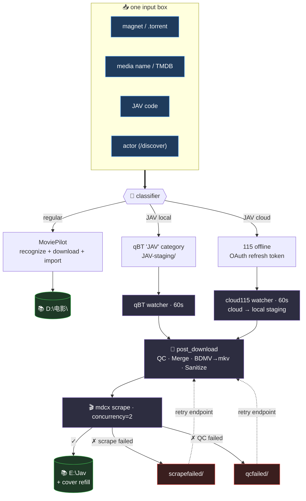

<p align="center">
  
</p>

<p align="center"><b>English</b> · <a href="README.zh.md">中文</a></p>

# mp-relay

Funnels "paste a magnet / type a media name / type a JAV code / find an actor"
into a single Web UI and auto-dispatches it to the right download/scrape
pipeline. Runs on a Windows media server (same box as MoviePilot /
qBittorrent / mdcx); single-page Web UI listening on `:5000`.


```mermaid
flowchart TD
    classDef input    fill:#1f3b5c,stroke:#4a9eff,color:#fff
    classDef pipe     fill:#2d2d40,stroke:#7c5fb8,color:#fff
    classDef ok       fill:#1e3a26,stroke:#3fb950,color:#fff
    classDef bad      fill:#3a1e1e,stroke:#f85149,color:#fff

    subgraph IN["📥 one input box"]
      direction LR
      I1["magnet / .torrent"]:::input
      I2["media name / TMDB"]:::input
      I3["JAV code"]:::input
      I4["actor (/discover)"]:::input
    end

    IN ==> CLF{{"🎯 classifier"}}

    CLF -->|regular| MP["MoviePilot<br/>recognize + download + import"]
    CLF -->|JAV local| QBT["qBT 'JAV' category<br/>JAV-staging/"]
    CLF -->|JAV cloud| C115["115 offline<br/>OAuth refresh token"]

    MP --> LibMP[("📚 D:\电影\")]:::ok
    QBT --> WQ["qBT watcher · 60s"]:::pipe
    C115 --> WC["cloud115 watcher · 60s<br/>cloud → local staging"]:::pipe

    WQ --> POST
    WC --> POST

    POST["🔧 post_download<br/>QC · Merge · BDMV→mkv · Sanitize"]:::pipe
    POST --> MDCX["🎬 mdcx scrape · concurrency=2"]:::pipe

    MDCX -->|✓| LibJav[("📚 E:\Jav<br/>+ cover refill")]:::ok
    MDCX -->|✗ scrape failed| F1["scrapefailed/"]:::bad
    MDCX -->|✗ QC failed| F2["qcfailed/"]:::bad

    F1 -.retry endpoint.-> POST
    F2 -.retry endpoint.-> POST
```

## Web UI at a glance

| Path | Purpose |
|---|---|
| **`/`** | Single-input home + recent-task list (auto-refresh every 10s) + a collapsible **cover-refill panel** for bulk-backfilling missing JAV covers |
| **`/discover`** | Actor discovery — search an actor's name → list all of their codes (can hide ones you already own) → multi-select and bulk "add to qBT" or "add to 115" |
| **`/setup`** | Config wizard — 4 cards (mdcx / MoviePilot / qBittorrent / Jellyfin), each with Test connection + Save, hot-reloaded without a restart |
| **`/health`** | JSON health check — per-service status for mdcx / Telegram / Bangumi / 115 |
| **`/metrics`** | Prometheus metrics — the `mp-relay-grafana.json` dashboard imports directly |
| `/auth/115` | 115 OAuth device-code authorization page (used the first time you set up 115 offline) |

## Design goals

- **One input box**: paste anything — it auto-detects magnet / .torrent URL / JAV code / media name / actor
- **Don't reinvent the wheel**: anything MoviePilot already does (TMDB recognition / site search / organize-and-import) is left to it
- **JAV gets a dedicated pipeline**: MoviePilot can't recognize JAV codes, so mdcx takes over
- **Fully automated**: watchers monitor qBT / 115 completion events → post-download pipeline → mdcx → archive
- **Fail-soft**: every step can detect failure, flag it, and be re-run via a retry endpoint

## Main features

Organized into four tiers — input → dispatch → post-processing → ops (the dev timeline is tagged `Phase X` in `git log`).

### 📥 Input & search
- **Unified recognition** of magnet / `.torrent` URL / media name / TMDB ID / JAV code / TMDB or Douban detail-page URL
- **Code → torrent search**: sukebei + JavBus + JavDB + MissAV queried in parallel (deduped by hash; sorted by suspicion↑ / Chinese-subs↑ / seeders↑ / quality↑ / size↑)
- **Actor discovery** (`/discover`): lists every code under an actor / series / studio / genre / director, "hide owned" filters out local-library duplicates, multi-select to add to qBT or 115 in one click
- **Name fallback**: when TMDB returns 0 candidates, falls back to Bangumi + AniList automatically (high hit rate for anime aliases)

### 🚀 Dispatch — pick one of three pipelines as needed

| Input type | Backend | Destination |
|---|---|---|
| Regular media | MoviePilot `/api/v1/download/add` | auto-recognize + download + organize into `D:\电影\` |
| JAV / local download | qBT `JAV` category | `G:\Downloads\JAV-staging\` |
| JAV / cloud download | 115 OAuth `offline_add_url` | after the cloud finishes, the watcher syncs it back to local staging |

### 🔧 Post-download processing (all JAV tasks go through the same pipeline)
1. **QC**: ffprobe duration + file size, filtering out fake files / full-length ad watermarks / 11 MiB placeholders
2. **Merge**: CD1+CD2... → single `.mp4` (concat-copy); BDMV/VIDEO_TS → single `.mkv` (remux the main playlist)
3. **Sanitize**: strips `[4K]` / `@` / `()` and other characters that blind mdcx's globbing
4. **mdcx scrape**: concurrency capped at 2 (an early 60-way concurrency storm got rate-limited to a standstill by JavBus, hard-capped ever since)
5. **Cover refill**: when mdcx is blocked from covers by Cloudflare, falls back to the JavDB CDN using the `javdbid` in the NFO to backfill `poster / fanart / thumb / folder`
6. **Ad-trim** *(opt-in, off by default)*: fingerprints the audio at the video's head and, if it matches a known spliced-in promo/ad clip, losslessly trims it (`ffmpeg -c copy`, keyframe-snapped; original kept as `.preadcut.bak`). See [Ad-fingerprint de-advertising](#-ad-fingerprint-de-advertising-opt-in) below.

Failures land in one of two buckets (paths configurable in `/setup`, default sibling-collector):
- `scrapefailed/` — mdcx didn't recognize it → re-run via `/api/cloud115/retry-failed-scrapes`
- `qcfailed/` — QC failed → auto-swaps to the next candidate torrent (up to 3 times)

### ⚙️ Ops / monitoring
- **`/setup` config wizard**: four cards (mdcx / MoviePilot / qBT / Jellyfin), Test connection + Save, hot-reloaded without a restart
- **mdcx field passthrough**: 8 frequently-changed fields (`success_output_folder` / `proxy` / `timeout` / ...) bridged through the mdcx CLI, editable right on mp-relay's setup page
- **`/metrics` Prometheus** + Grafana dashboard (`deploy/grafana/`): task counts / per-stage durations / mdcx success rate
- **Telegram notifications**: key events (`qc_failed_exhausted` / `scrape_failed` / `scraped`) pushed to a DM
- **115 token auto-renew**: refresh token is persisted; when the watcher detects `state=false` it silently tops it up — no manual re-authorization needed
- **Cover-refill panel** (collapsible on `/`, backed by `POST /api/cover-refill`): point it at a library root (default `M:/Jav`), **preview** (dry-run, no writes) or run it to backfill every cover-less folder — pulls official art from JavBus / AVSOX / JavDB, crops to portrait, writes the standard `poster / fanart / thumb / folder` names. Complements the automated per-task fallback (step 5 above) for bulk gap-filling after a big import; `limit` lets you run it in batches

### 🧹 Ad-fingerprint de-advertising (opt-in)

Pirate re-uploads often splice a short promo/ad clip onto the **head** of the real
video, and reuse the same clip across many releases from the same source.
`app/ad_fingerprint.py` fingerprints known ad clips with a **Haitsma-Kalker robust
audio hash** (from an 8 kHz mono downmix, so it survives re-encoding / rescaling /
re-watermarking) and, on a head match, trims the ad **losslessly** (`ffmpeg -c copy`,
keyframe-snapped; original kept as `.preadcut.bak`). Pure-Python (no numpy) — ffmpeg
is the only external dependency.

> Removes **spliced-in segments** only. It cannot remove a burned-in corner watermark
> (that's overlaid on every frame, not an extra segment — for those, re-source the file).

Seed the fingerprint DB (`ad_fingerprints.json`, kept next to `state.db`) once per ad
clip; matches are then caught automatically:

```
python -m app.ad_fingerprint add  <name> <ad-clip.mp4> [--dur SECONDS] [--note ...]
python -m app.ad_fingerprint list
python -m app.ad_fingerprint scan <video>            # report matches only
python -m app.ad_fingerprint cut  <video> --apply    # trim (dry-run without --apply)
```

Enable the automatic pipeline step (runs just before QC) with `AD_DETECT_ENABLED=true`.
The step runs in a worker thread and is wrapped so any failure is logged and never
breaks the pipeline.

## Configuration

**Recommended**: after install, open `/setup` in a browser and complete configuration card by card with Test + Save.

**Manual**: `.env.example → .env`; key fields below (these are also the fields `/setup` writes on the backend):

```ini
# MoviePilot
MP_URL=http://localhost:3000
MP_USER=admin
MP_PASS=change-me

# qBittorrent WebUI
QBT_URL=http://localhost:8080
QBT_USER=admin
QBT_PASS=change-me
QBT_JAV_CATEGORY=JAV
QBT_JAV_SAVEPATH=G:\Downloads\JAV-staging

# mdcx fork (CLI entrypoint is mdcx.cmd.main)
# https://github.com/sqzw-x/mdcx               (upstream GUI version)
# https://github.com/naughtyGitCat/mdcx        (this fork adds the CLI)
MDCX_DIR=E:\mdcx-src
MDCX_PYTHON=E:\mdcx-src\.venv\Scripts\python.exe
MDCX_MODULE=mdcx.cmd.main

# Jellyfin (optional, for future library-refresh triggering)
JELLYFIN_URL=
JELLYFIN_API_KEY=

# Telegram notifications (optional)
TELEGRAM_BOT_TOKEN=
TELEGRAM_CHAT_ID=

# Ad-fingerprint de-advertising (opt-in; see README). Off by default.
AD_DETECT_ENABLED=false
AD_DETECT_HEAD_SEC=150
```

> ⚠ **Personal-use tool.** Designed for my homelab; defaults assume a single-user
> Windows machine on a trusted LAN. Do not expose `:5000` to the internet —
> there is no auth on mp-relay itself, and it can add arbitrary downloads.

## Deployment

**End users**: download the latest `mp-relay-Setup-<version>.exe` from
[Releases](https://github.com/naughtyGitCat/mp-relay/releases) and double-click
to install. The installer bundles a Python runtime + NSSM; the wizard ticks
"Install as Windows service" by default. After installing, open `/setup` in a
browser to configure the dependent services. See [`deploy/README.md`](deploy/README.md).

**Dev iteration**: use [`deploy/install-on-windows.ps1`](deploy/install-on-windows.ps1)
(scp source to the host + create a venv + register the service); after changing
code just rsync + restart the service — no need to cut a release each time.

**Building the .exe**: [`build/README.md`](build/README.md) — two triggers:
- **Every push to `main`** → auto-produces a `build-<n>` prerelease (version `YYYY.MM.DD.<run>`)
- **Tagging `v*`** → produces a stable release (version = the tag minus the `v` prefix)

**Integration tests (WIP)**: [`tests/integration/packer/README.md`](tests/integration/packer/README.md) —
Packer + autounattend.xml fully automate spinning up Win11 24H2 + installing
mp-relay + smoke-testing `/health`. A few Win11-24H2-parser-bug landmines are
documented but it's not finished. Testing currently uses a Hyper-V checkpoint to
freeze the `mp-relay-test` VM as a pristine baseline.

## Reference projects (design references in the same space)

Related projects researched while building this — **not dependencies**, just
borrowed architecture / data sources / metadata strategy:

| Repo | Borrowed from |
|---|---|
| [yuukiy/JavSP](https://github.com/yuukiy/JavSP) | JAV-code regexes (covering each studio's format); local batch-organize flow; multi-source fallback |
| [dirtyracer1337/Jellyfin.Plugin.PhoenixAdult](https://github.com/dirtyracer1337/Jellyfin.Plugin.PhoenixAdult) | scrape-directly-in-Jellyfin approach; usable as a fallback metadata source when mdcx fails |
| [guyueyingmu/avbook](https://github.com/guyueyingmu/avbook) | actor-dimension discovery / index UI ideas; filtering by studio/genre |
| [gfriends/gfriends](https://github.com/gfriends/gfriends) | actor headshot database (commit-only repo); fallback when mdcx can't find a headshot |
| [zyd16888/sehuatang](https://github.com/zyd16888/sehuatang) | sehuatang-forum scraping / code → magnet mapping, **the early Phase 1 code→torrent data source** |

Per-project notes live in [`docs/references.md`](docs/references.md).

## Caveats / known gotchas

- **Failed staging needs periodic manual handling** — `scrapefailed/` (mdcx didn't
  recognize it) and `qcfailed/` (QC failed) both keep accumulating; their paths
  are configurable in `/setup`. Failed items synced from 115 can be bulk re-run
  via `/api/cloud115/retry-failed-scrapes`
- **Changing a qBT category save_path does not migrate the download location of existing torrents**
- **Watchers use polling** (default 60s interval) — easy on qBT/115 but up to 60s of latency
- **`/discover`'s JavBus scraping is affected by Cloudflare** — meanwhile covers are
  fetched via the server-side `/api/img-proxy` + Referer injection to get around it;
  when mdcx can't fetch a cover, `cover-refill` backfills it
- **115 download URLs are bound to the UA** — mp-relay uses a pinned Chrome UA for both
  signing the URL and the HTTP GET, otherwise 403
- **`:5000` has no auth** — don't expose it to the internet; trusted LAN only
